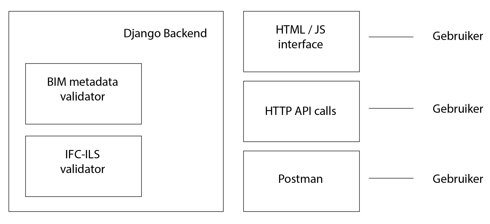

# DHRD - Duurzaam Hergebruik van Ruimtelijke Data

## Project scope
De validatie-tool toetst of de export van een BIM-model uit een informatiesysteem de volledige informatie bevat. De technische specificaties voor het maken van een tool worden gebaseerd op de uitkomsten uit de DUTO-scan en de ervaringen met technische specificaties van vergelijkbare webservices voor validatie van bestanden voor preservering. Er wordt gericht op het uitwerken van een microservice. Vervolgens wordt de tool daadwerkelijk gebouwd. Deze tool wordt gefaseerd opengesteld voor een breed publiek en kan dankzij de opzet als webservice op twee verschillende manieren gebruikt worden: als losse applicatie of als een component die aan een open source (e-depot)-applicatie gehangen kan worden. Er wordt gekozen voor een open source applicatie (MIT licentie). Door de laagdrempeligheid van de applicatie, groeit de gebruikersgroep in Nederland gestaag. De validatie-tool wordt ingezet voor het toetsen van kerncriteria van een duurzame toegankelijk BIM-model: metadata, kwaliteit van informatie, standaardformaat, volledigheid, integriteit.

## User Requirements
Een User Requirements Document (URD) werd opgemaakt. Dit document lijst de eisen op die aan de hand van workshops werden opgehaald bij eindgebruikers. Aan de hand daarvan worden eisen ontworpen voor de ‘BIM-validator’ tool die ontwikkeld moet worden.

> [Download URD (PDF)](../1.%20User%20requirements/03.%2020211209_URD.pdf)

Uit het URD wordt volgende systeemarchitectuur afgeleid / uitgewerkt:

## Implementatie
Op basis van het URD wordt een Technische Specificatie uitgewerkt. Dit document werd uitgewerkt in parallel met het software-ontwikkelingstraject.

> [Download Technische Specificatie (PDF)](../2.%20Technische%20specificatie/04.%2020220821_techspec%20v0.2.1.pdf)

De validatie-tool maakt gebruik van de open-source IFC tester functionaliteit die beschikbaar is op https://github.com/IfcOpenShell/IfcOpenShell/tree/v0.7.0/src/ifctester.

## Meer informatie over ontwikkelde software
Pieter Pauwels, TU Eindhoven  
Chiel van der Plas, TU Eindhoven  
Jakob Beetz, RWTH Aachen

